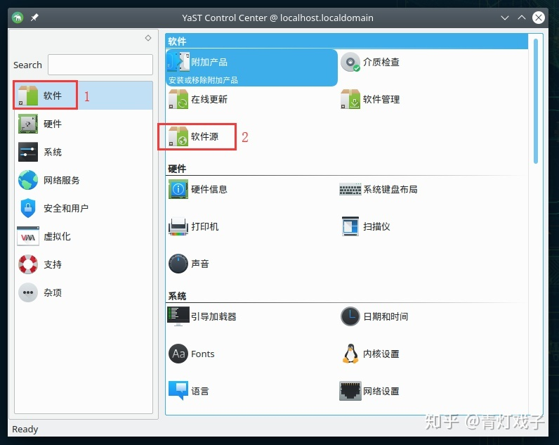
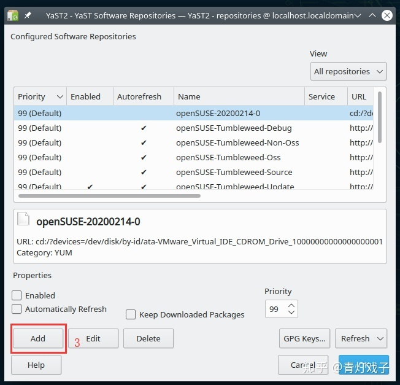

# openSUSE Tumbleweed安装后配置

> 注：本文首发于本人知乎账号，故而图片水印带有“知乎”字样，[阅读原文](https://zhuanlan.zhihu.com/p/107763542)


## 1.软件源配置
YaST → 软件 → 软件源 → Add





在弹出窗口中点击Next → Repository → Name命名为`tuna-oss` → URL填写如下：
```txt
https://mirrors.tuna.tsinghua.edu.cn/opensuse/tumbleweed/repo/oss/
```

点击next

重复Add这个过程，继续添加以下URL：
```txt
tuna-non-oss
https://mirrors.tuna.tsinghua.edu.cn/opensuse/tumbleweed/repo/non-oss/
```

```txt
tuna-tumbleweed
https://mirrors.tuna.tsinghua.edu.cn/packman/suse/openSUSE_Tumbleweed/
```

至此，软件源添加完毕，。然后禁止原先自带的源：


选择这两个源，将其取消禁用（因为我们新添加的清华园可以替代这两个官方源）。

点击OK推出。

## 2.软件源相关命令
打开终端，输入命令安装：
```bash
sudo zypper ar -f URL name //添加一个名为name的软件源
sudo zypper ref // 刷新软件源
sudo zypper lr // 查看已定义软件源
sudo zypper rr name // 删除名为name的软件源
```

## 3.解码器以及部分软件解码器的安装（几乎必备）‘
```bash
sudo zypper install flash-player // 火狐浏览器安装flash插件
sudo zypper install xine-browser-plugin // 让浏览器支持多媒体流播放
sudo zypper install flash-player-ppapi // chromium flash插件
```

## 4.常用软件安装
```bash
sudo zypper install vlc-codecs vlc-lang vlc-devel // 安装vlc（可能已经安装）
sudo zypper install netease-cloud-music // 安装网易云音乐
sudo zypper install chromiun // 安装chromium
sudo zypper install sogou-pinyin // 安装搜狗输入法
```

## 5.安装deb包
```bash
sudo zypper in dpkg sudo dpkg -i xxx.deb
```
